# Deteksi Keberadaan Tanda Tangan pada Ijazah (Mini Project Pengolahan Citra Digital)

Pipeline klasik (tanpa deep learning): **crop ROI → grayscale → thresholding (global, Otsu, adaptive) → morfologi (opening + closing) → fitur area → aturan `SIGNATURE PRESENT / ABSENT`**.

Data: 9 varian citra satu ijazah (high-quality, low-contrast, blurred, high-noise, low-res, faded, color-shift, JPEG artifact, combined degradation) dari `IJAZAH_PCD.pdf`.

> **Catatan tentang "kepala sekolah"**: ijazah ini dari universitas, jadi padanannya adalah **Rektor** (kepala institusi). Program juga menguji tanda tangan **Dekan** dan **pemilik ijazah**.

## Struktur

```
.
├── run_pipeline.py        # program utama (batch & satu citra)
├── extract_from_pdf.py    # ekstrak 9 citra dari PDF -> data/certs/
├── generate_report.py     # hasil per citra: gambar + README
├── src/sigdetect.py       # crop, threshold, morfologi, fitur, aturan keputusan
├── data/IJAZAH_PCD.pdf    # sumber
├── data/certs/*.png       # 9 citra (sudah ditegakkan)
└── outputs/               # hasil: results.csv, metrics.md, gambar perbandingan
```

## Cara menjalankan

Python 3.9+.

```bash
git clone https://github.com/IzzatulJannah9/tugas6_PCD.git
cd tugas6_PCD

python -m venv .venv
source .venv/bin/activate          # Windows: .venv\Scripts\activate
pip install -r requirements.txt

# (opsional) regenerasi citra dari PDF. data/certs/ sudah disertakan.
python extract_from_pdf.py data/IJAZAH_PCD.pdf

# 1) Batch: uji semua citra (positif + negatif), cetak tabel akurasi, simpan gambar ke outputs/
python run_pipeline.py

# 2) Hasil per citra (gambar + bagian 'Hasil per citra' di README ini)
python generate_report.py

# 3) Satu citra + satu ROI
python run_pipeline.py --image data/certs/03_blurred.png --roi rektor
python run_pipeline.py --image data/certs/03_blurred.png --roi kosong_kiri
```

Pilihan `--roi`: `rektor`, `dekan`, `pemilik` (ada tanda tangan) dan `kosong_kiri`, `kosong_atas`, `teks_nama`, `teks_nomor` (tidak ada tanda tangan).

Contoh keluaran:

```
[otsu    ] fg_pixels= 1665 fg_ratio=0.057 komponen=1 connectivity=1.00 -> SIGNATURE PRESENT
KEPUTUSAN AKHIR (Otsu + morfologi): SIGNATURE PRESENT
```

File hasil di `outputs/`: `results.csv` (per kasus: jumlah piksel foreground & prediksi tiap metode), `metrics.md`, `threshold_comparison_rektor.png`, `threshold_comparison_dekan.png`, `morphology_effect.png`, `threshold_too_low_high.png`, `fg_ratio_vs_threshold.png`, `decision_examples.png`.

## Metode

1. **Crop ROI**: koordinat relatif (persen lebar/tinggi), jadi berlaku untuk semua resolusi. ROI di-resize ke lebar 300 px agar jumlah piksel dan ukuran kernel konsisten antar varian.
2. **Grayscale** (`cv2.cvtColor`) + Gaussian blur 3×3.
3. **Thresholding** (tinta = foreground, `THRESH_BINARY_INV`):
   - Global tetap, T = 127
   - Otsu (T dihitung otomatis dari histogram)
   - Adaptive Gaussian (blok 31, C = 12)
4. **Morfologi**: opening elips 2×2 (buang bintik noise), lalu closing elips 5×5 (sambung goresan putus).
5. **Fitur**: `fg_pixels`, `fg_ratio`, jumlah komponen, `connectivity` (= komponen terbesar / total foreground), lebar & tinggi bounding box relatif, `ink_contrast` (= (median latar − persentil-1) / median).
6. **Aturan** (`src/sigdetect.py`, `RULE`): **PRESENT** jika semua terpenuhi:
   - `ink_contrast ≥ 0.10`: ada piksel yang jauh lebih gelap dari kertas. Ini mencegah Otsu "mengarang" foreground dari noise/gradien kertas kosong.
   - `0.03 ≤ fg_ratio ≤ 0.40`
   - `connectivity ≥ 0.55`: tanda tangan = satu goresan menyambung; teks tercetak = banyak komponen kecil.
   - `bbox_w ≥ 0.35` dan `bbox_h ≥ 0.45`

## Hasil pengujian

63 kasus uji = 9 varian × (3 ROI bertanda tangan + 4 ROI tanpa tanda tangan).

| Metode threshold | Akurasi | Benar/Total | FP | FN |
|---|---|---|---|---|
| Global (T=127) | 60.3% | 38/63 | 0 | 25 |
| **Otsu** | **100%** | 63/63 | 0 | 0 |
| Adaptive Gaussian | 90.5% | 57/63 | 0 | 6 |

- **Global T=127 gagal** pada 25 kasus. Pada citra terang/low-contrast/blur, goresan tipis punya intensitas > 127 sehingga tanda tangan terpotong-potong atau hilang. Pada citra *faded* (06) yang kertasnya gelap, justru berhasil, tetapi satu angka tetap tidak bisa cocok untuk semua kondisi.
- **Otsu** menyesuaikan T tiap citra (T berkisar ≈ 138–218), sehingga stabil di semua varian.
- **Adaptive** bagus untuk pencahayaan tidak merata, tetapi pada tanda tangan pemilik (kecil dan tipis) sering terlalu sensitif terhadap noise/latar.
- Morfologi (`morphology_effect.png`): opening membuang bintik, closing menyatukan goresan yang putus sehingga jumlah komponen turun dan `connectivity` naik.

## Analisis

**Mengapa thresholding diperlukan sebelum analisis keberadaan tanda tangan?**
Pertanyaan "ada tanda tangan atau tidak" butuh pemisahan piksel tinta (objek) dari kertas (latar). Citra grayscale hanya berisi 256 tingkat keabuan; kita tidak bisa menghitung luas, komponen, atau bentuk goresan tanpa label biner foreground/background. Thresholding mengubah masalah menjadi pengukuran sederhana pada citra biner (jumlah piksel foreground, komponen terhubung, bounding box). Tanpa itu, variasi pencahayaan, warna kertas, dan noise langsung bercampur ke ukuran yang kita pakai.

**Apa yang terjadi jika threshold terlalu tinggi atau terlalu rendah?** (lihat `threshold_too_low_high.png` dan `fg_ratio_vs_threshold.png`)
- **Terlalu rendah** (mis. T=80): hanya bagian tinta tergelap yang lolos. Goresan tipis/blur/pudar terputus atau hilang (`fg_ratio` 0.001 pada contoh), sehingga tanda tangan nyata dinilai ABSENT (**false negative**). Ini yang terjadi pada global T=127 di banyak varian.
- **Terlalu tinggi** (mis. T=252, di atas kecerahan kertas): kertas ikut menjadi foreground (`fg_ratio` = 1.0). Tanda tangan tenggelam, dan area kosong bisa dinilai PRESENT (**false positive**). Rentang tengah (T≈200–240) masih memberi bentuk yang wajar tetapi goresan makin tebal dan noise kertas mulai masuk.
- Otsu mencari T yang meminimalkan varians dalam-kelas, tetapi pada ROI yang tidak punya tinta (unimodal) ia tetap memotong noise kertas menjadi foreground. Itu sebabnya aturan memakai `ink_contrast` sebagai pengaman.

## Keterbatasan (penting dibaca)

- **Semua 9 citra berasal dari satu ijazah yang sama**, hanya dengan degradasi berbeda. Ini bukan data independen.
- **Tidak ada ijazah tanpa tanda tangan** pada data. Kelas "ABSENT" dibuat dari ROI kertas kosong dan teks tercetak pada ijazah yang sama. Untuk uji yang lebih kuat, tambahkan ijazah berbeda dan versi tanpa tanda tangan ke `data/`.
- **Ambang aturan disetel pada data uji yang sama** (tidak ada split train/test), jadi akurasi 100% untuk Otsu adalah *optimistis* dan bukan estimasi performa umum.
- ROI memakai koordinat tetap (relatif), sehingga mengasumsikan tata letak ijazah yang sama dan sudah tegak. Dokumen dengan tata letak lain butuh deteksi ROI otomatis.
- Pemisahan teks pendek (`teks_nomor`) dari tanda tangan bergantung pada `bbox_h`, heuristik yang sensitif terhadap ukuran ROI.

## Privasi

`data/` berisi ijazah asli (nama, tanggal lahir, NIM). Sebelum membuat repositori **publik**, hapus atau samarkan data tersebut, atau gunakan repositori privat.

<!-- HASIL-PER-CITRA:START -->
## Hasil per citra

Ringkasan: **27/27** area diklasifikasikan benar (2 area bertanda tangan + 1 area kosong, pada 9 varian citra).

### 1. Citra 1 (highquality_enhanced)

**Area Rektor (Ada TTD)**

| Karakteristik (Otsu + opening + closing) | Nilai |
|---|---|
| Status | **SIGNATURE PRESENT** |
| Foreground pixels | 1831 / 29100 |
| Kepadatan piksel | 0.0629 |
| Komponen terhubung | 1 |
| Connectivity | 1.00 |
| Kontras tinta | 0.504 |

**Analisis perbandingan**

- Thresholding
  - Global (T=127) hanya menangkap 351 piksel (20% dari hasil Otsu): goresan tipis terputus atau hilang karena intensitasnya di atas 127 (false negative).
  - Otsu memilih T=197 secara otomatis dan menangkap 1732 piksel foreground (2 komponen).
  - Adaptive menangkap 1778 piksel dengan 2 komponen; jumlah komponennya mirip Otsu.
- Morfologi
  - Opening: komponen 2 -> 2, foreground 1732 -> 1742 piksel. Closing: komponen 2 -> 1, foreground 1742 -> 1831 piksel. Hasil akhir: komponen terbesar mencakup 100% dari seluruh foreground (connectivity).


Hasil sesuai harapan: **Ya**

**Area Dekan (Ada TTD)**

| Karakteristik (Otsu + opening + closing) | Nilai |
|---|---|
| Status | **SIGNATURE PRESENT** |
| Foreground pixels | 5444 / 35400 |
| Kepadatan piksel | 0.1538 |
| Komponen terhubung | 7 |
| Connectivity | 0.90 |
| Kontras tinta | 0.629 |

**Analisis perbandingan**

- Thresholding
  - Global (T=127) hanya menangkap 1071 piksel (21% dari hasil Otsu): goresan tipis terputus atau hilang karena intensitasnya di atas 127 (false negative).
  - Otsu memilih T=197 secara otomatis dan menangkap 5058 piksel foreground (10 komponen).
  - Adaptive menangkap 5028 piksel dengan 13 komponen; terdapat bintik noise tambahan di sekitar goresan.
- Morfologi
  - Opening: komponen 10 -> 10, foreground 5058 -> 5045 piksel. Closing: komponen 10 -> 7, foreground 5045 -> 5444 piksel. Hasil akhir: komponen terbesar mencakup 90% dari seluruh foreground (connectivity).


Hasil sesuai harapan: **Ya**

**Area Blank (Tanpa TTD)**

| Karakteristik (Otsu + opening + closing) | Nilai |
|---|---|
| Status | **SIGNATURE ABSENT** |
| Foreground pixels | 61305 / 81600 |
| Kepadatan piksel | 0.7513 |
| Komponen terhubung | 1 |
| Connectivity | 1.00 |
| Kontras tinta | 0.016 |

**Analisis perbandingan**

- Thresholding
  - Global (T=127): 0 piksel foreground; kertas kosong lebih terang dari 127 sehingga hampir bersih.
  - Otsu (T=243) menghasilkan 60888 piksel foreground (74.6% dari ROI). Ini bukan tinta: Otsu selalu membagi histogram menjadi dua kelas, sehingga pada ROI tanpa tinta ia memotong gradien/noise kertas.
  - Adaptive menghasilkan 0 piksel foreground (0 komponen).
- Morfologi
  - Morfologi: komponen 1 -> 1, foreground 60888 -> 61305 piksel. Keputusan ABSENT ditentukan oleh syarat kontras tinta: ink_contrast = 0.016 (< 0,10), artinya tidak ada piksel yang benar-benar gelap dibanding kertas.

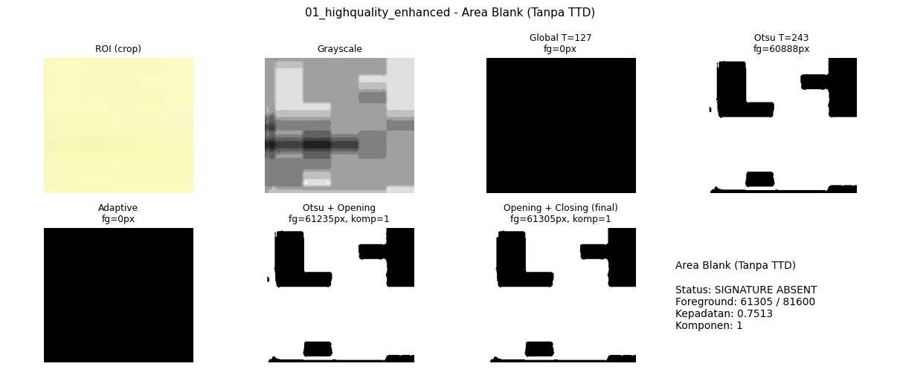

Hasil sesuai harapan: **Ya**

### 2. Citra 2 (low_contrast)

**Area Rektor (Ada TTD)**

| Karakteristik (Otsu + opening + closing) | Nilai |
|---|---|
| Status | **SIGNATURE PRESENT** |
| Foreground pixels | 1955 / 29400 |
| Kepadatan piksel | 0.0665 |
| Komponen terhubung | 1 |
| Connectivity | 1.00 |
| Kontras tinta | 0.272 |

**Analisis perbandingan**

- Thresholding
  - Global (T=127) hanya menangkap 8 piksel (0% dari hasil Otsu): goresan tipis terputus atau hilang karena intensitasnya di atas 127 (false negative).
  - Otsu memilih T=218 secara otomatis dan menangkap 1830 piksel foreground (2 komponen).
  - Adaptive menangkap 1599 piksel dengan 2 komponen; jumlah komponennya mirip Otsu.
- Morfologi
  - Opening: komponen 2 -> 2, foreground 1830 -> 1832 piksel. Closing: komponen 2 -> 1, foreground 1832 -> 1955 piksel. Hasil akhir: komponen terbesar mencakup 100% dari seluruh foreground (connectivity).


Hasil sesuai harapan: **Ya**

**Area Dekan (Ada TTD)**

| Karakteristik (Otsu + opening + closing) | Nilai |
|---|---|
| Status | **SIGNATURE PRESENT** |
| Foreground pixels | 5361 / 35100 |
| Kepadatan piksel | 0.1527 |
| Komponen terhubung | 7 |
| Connectivity | 0.79 |
| Kontras tinta | 0.337 |

**Analisis perbandingan**

- Thresholding
  - Global (T=127) hanya menangkap 1 piksel (0% dari hasil Otsu): goresan tipis terputus atau hilang karena intensitasnya di atas 127 (false negative).
  - Otsu memilih T=218 secara otomatis dan menangkap 4897 piksel foreground (9 komponen).
  - Adaptive menangkap 3799 piksel dengan 21 komponen; terdapat bintik noise tambahan di sekitar goresan.
- Morfologi
  - Opening: komponen 9 -> 9, foreground 4897 -> 4868 piksel. Closing: komponen 9 -> 7, foreground 4868 -> 5361 piksel. Hasil akhir: komponen terbesar mencakup 79% dari seluruh foreground (connectivity).

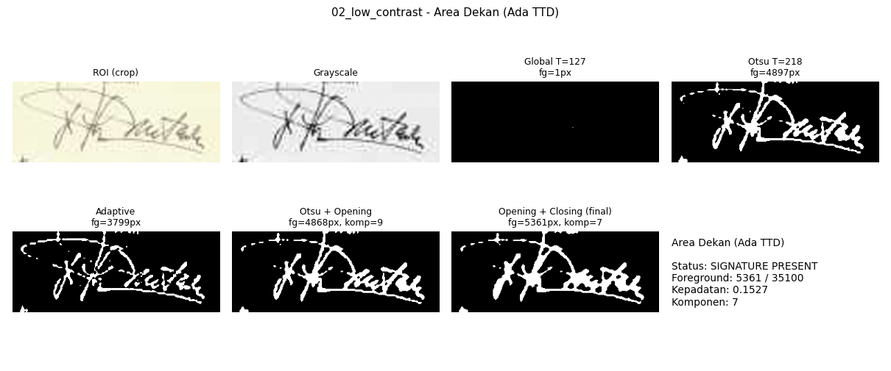

Hasil sesuai harapan: **Ya**

**Area Blank (Tanpa TTD)**

| Karakteristik (Otsu + opening + closing) | Nilai |
|---|---|
| Status | **SIGNATURE ABSENT** |
| Foreground pixels | 62042 / 81900 |
| Kepadatan piksel | 0.7575 |
| Komponen terhubung | 1 |
| Connectivity | 1.00 |
| Kontras tinta | 0.000 |

**Analisis perbandingan**

- Thresholding
  - Global (T=127): 0 piksel foreground; kertas kosong lebih terang dari 127 sehingga hampir bersih.
  - Otsu (T=242) menghasilkan 61823 piksel foreground (75.5% dari ROI). Ini bukan tinta: Otsu selalu membagi histogram menjadi dua kelas, sehingga pada ROI tanpa tinta ia memotong gradien/noise kertas.
  - Adaptive menghasilkan 0 piksel foreground (0 komponen).
- Morfologi
  - Morfologi: komponen 1 -> 1, foreground 61823 -> 62042 piksel. Keputusan ABSENT ditentukan oleh syarat kontras tinta: ink_contrast = 0.000 (< 0,10), artinya tidak ada piksel yang benar-benar gelap dibanding kertas.

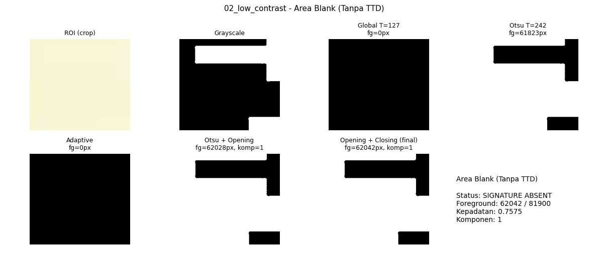

Hasil sesuai harapan: **Ya**

### 3. Citra 3 (blurred)

**Area Rektor (Ada TTD)**

| Karakteristik (Otsu + opening + closing) | Nilai |
|---|---|
| Status | **SIGNATURE PRESENT** |
| Foreground pixels | 1665 / 29400 |
| Kepadatan piksel | 0.0566 |
| Komponen terhubung | 1 |
| Connectivity | 1.00 |
| Kontras tinta | 0.453 |

**Analisis perbandingan**

- Thresholding
  - Global (T=127) hanya menangkap 210 piksel (13% dari hasil Otsu): goresan tipis terputus atau hilang karena intensitasnya di atas 127 (false negative).
  - Otsu memilih T=202 secara otomatis dan menangkap 1590 piksel foreground (2 komponen).
  - Adaptive menangkap 1612 piksel dengan 2 komponen; jumlah komponennya mirip Otsu.
- Morfologi
  - Opening: komponen 2 -> 2, foreground 1590 -> 1598 piksel. Closing: komponen 2 -> 1, foreground 1598 -> 1665 piksel. Hasil akhir: komponen terbesar mencakup 100% dari seluruh foreground (connectivity).


Hasil sesuai harapan: **Ya**

**Area Dekan (Ada TTD)**

| Karakteristik (Otsu + opening + closing) | Nilai |
|---|---|
| Status | **SIGNATURE PRESENT** |
| Foreground pixels | 5091 / 35400 |
| Kepadatan piksel | 0.1438 |
| Komponen terhubung | 5 |
| Connectivity | 0.83 |
| Kontras tinta | 0.565 |

**Analisis perbandingan**

- Thresholding
  - Global (T=127) hanya menangkap 720 piksel (15% dari hasil Otsu): goresan tipis terputus atau hilang karena intensitasnya di atas 127 (false negative).
  - Otsu memilih T=203 secara otomatis dan menangkap 4647 piksel foreground (4 komponen).
  - Adaptive menangkap 4664 piksel dengan 5 komponen; jumlah komponennya mirip Otsu.
- Morfologi
  - Opening: komponen 4 -> 7, foreground 4647 -> 4614 piksel. Closing: komponen 7 -> 5, foreground 4614 -> 5091 piksel. Hasil akhir: komponen terbesar mencakup 83% dari seluruh foreground (connectivity).

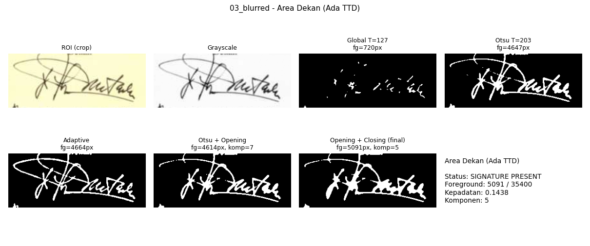

Hasil sesuai harapan: **Ya**

**Area Blank (Tanpa TTD)**

| Karakteristik (Otsu + opening + closing) | Nilai |
|---|---|
| Status | **SIGNATURE ABSENT** |
| Foreground pixels | 20922 / 82500 |
| Kepadatan piksel | 0.2536 |
| Komponen terhubung | 6 |
| Connectivity | 0.93 |
| Kontras tinta | 0.012 |

**Analisis perbandingan**

- Thresholding
  - Global (T=127): 0 piksel foreground; kertas kosong lebih terang dari 127 sehingga hampir bersih.
  - Otsu (T=244) menghasilkan 20559 piksel foreground (24.9% dari ROI). Ini bukan tinta: Otsu selalu membagi histogram menjadi dua kelas, sehingga pada ROI tanpa tinta ia memotong gradien/noise kertas.
  - Adaptive menghasilkan 0 piksel foreground (0 komponen).
- Morfologi
  - Morfologi: komponen 6 -> 6, foreground 20559 -> 20922 piksel. Keputusan ABSENT ditentukan oleh syarat kontras tinta: ink_contrast = 0.012 (< 0,10), artinya tidak ada piksel yang benar-benar gelap dibanding kertas.

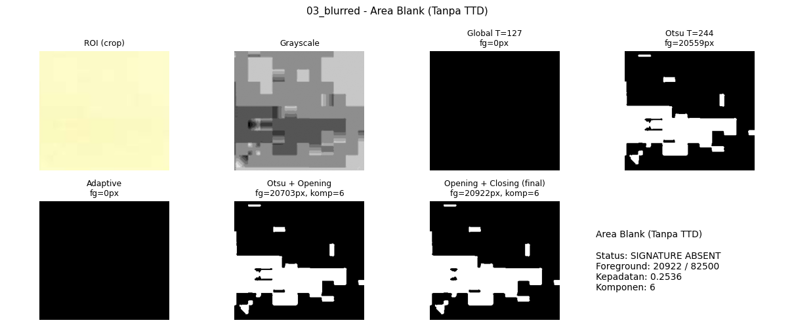

Hasil sesuai harapan: **Ya**

### 4. Citra 4 (high_noise)

**Area Rektor (Ada TTD)**

| Karakteristik (Otsu + opening + closing) | Nilai |
|---|---|
| Status | **SIGNATURE PRESENT** |
| Foreground pixels | 1549 / 29400 |
| Kepadatan piksel | 0.0527 |
| Komponen terhubung | 1 |
| Connectivity | 1.00 |
| Kontras tinta | 0.487 |

**Analisis perbandingan**

- Thresholding
  - Global (T=127) hanya menangkap 363 piksel (25% dari hasil Otsu): goresan tipis terputus atau hilang karena intensitasnya di atas 127 (false negative).
  - Otsu memilih T=191 secara otomatis dan menangkap 1461 piksel foreground (2 komponen).
  - Adaptive menangkap 1528 piksel dengan 2 komponen; jumlah komponennya mirip Otsu.
- Morfologi
  - Opening: komponen 2 -> 2, foreground 1461 -> 1474 piksel. Closing: komponen 2 -> 1, foreground 1474 -> 1549 piksel. Hasil akhir: komponen terbesar mencakup 100% dari seluruh foreground (connectivity).

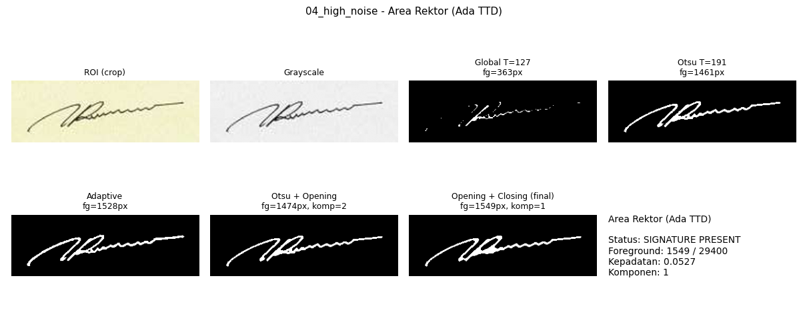

Hasil sesuai harapan: **Ya**

**Area Dekan (Ada TTD)**

| Karakteristik (Otsu + opening + closing) | Nilai |
|---|---|
| Status | **SIGNATURE PRESENT** |
| Foreground pixels | 4612 / 35100 |
| Kepadatan piksel | 0.1314 |
| Komponen terhubung | 8 |
| Connectivity | 0.78 |
| Kontras tinta | 0.601 |

**Analisis perbandingan**

- Thresholding
  - Global (T=127) hanya menangkap 988 piksel (24% dari hasil Otsu): goresan tipis terputus atau hilang karena intensitasnya di atas 127 (false negative).
  - Otsu memilih T=192 secara otomatis dan menangkap 4111 piksel foreground (6 komponen).
  - Adaptive menangkap 4423 piksel dengan 6 komponen; jumlah komponennya mirip Otsu.
- Morfologi
  - Opening: komponen 6 -> 8, foreground 4111 -> 4061 piksel. Closing: komponen 8 -> 8, foreground 4061 -> 4612 piksel. Hasil akhir: komponen terbesar mencakup 78% dari seluruh foreground (connectivity).


Hasil sesuai harapan: **Ya**

**Area Blank (Tanpa TTD)**

| Karakteristik (Otsu + opening + closing) | Nilai |
|---|---|
| Status | **SIGNATURE ABSENT** |
| Foreground pixels | 43832 / 82800 |
| Kepadatan piksel | 0.5294 |
| Komponen terhubung | 20 |
| Connectivity | 0.66 |
| Kontras tinta | 0.017 |

**Analisis perbandingan**

- Thresholding
  - Global (T=127): 0 piksel foreground; kertas kosong lebih terang dari 127 sehingga hampir bersih.
  - Otsu (T=236) menghasilkan 43247 piksel foreground (52.2% dari ROI). Ini bukan tinta: Otsu selalu membagi histogram menjadi dua kelas, sehingga pada ROI tanpa tinta ia memotong gradien/noise kertas.
  - Adaptive menghasilkan 0 piksel foreground (0 komponen).
- Morfologi
  - Morfologi: komponen 23 -> 20, foreground 43247 -> 43832 piksel. Keputusan ABSENT ditentukan oleh syarat kontras tinta: ink_contrast = 0.017 (< 0,10), artinya tidak ada piksel yang benar-benar gelap dibanding kertas.

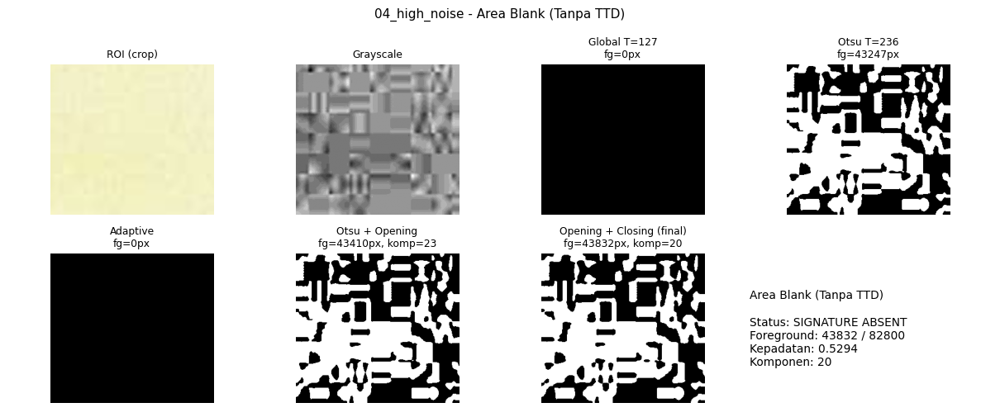

Hasil sesuai harapan: **Ya**

### 5. Citra 5 (lowres_upsampled)

**Area Rektor (Ada TTD)**

| Karakteristik (Otsu + opening + closing) | Nilai |
|---|---|
| Status | **SIGNATURE PRESENT** |
| Foreground pixels | 1766 / 29700 |
| Kepadatan piksel | 0.0595 |
| Komponen terhubung | 1 |
| Connectivity | 1.00 |
| Kontras tinta | 0.462 |

**Analisis perbandingan**

- Thresholding
  - Global (T=127) hanya menangkap 245 piksel (15% dari hasil Otsu): goresan tipis terputus atau hilang karena intensitasnya di atas 127 (false negative).
  - Otsu memilih T=201 secara otomatis dan menangkap 1658 piksel foreground (2 komponen).
  - Adaptive menangkap 1660 piksel dengan 2 komponen; jumlah komponennya mirip Otsu.
- Morfologi
  - Opening: komponen 2 -> 2, foreground 1658 -> 1671 piksel. Closing: komponen 2 -> 1, foreground 1671 -> 1766 piksel. Hasil akhir: komponen terbesar mencakup 100% dari seluruh foreground (connectivity).


Hasil sesuai harapan: **Ya**

**Area Dekan (Ada TTD)**

| Karakteristik (Otsu + opening + closing) | Nilai |
|---|---|
| Status | **SIGNATURE PRESENT** |
| Foreground pixels | 5235 / 35700 |
| Kepadatan piksel | 0.1466 |
| Komponen terhubung | 4 |
| Connectivity | 0.96 |
| Kontras tinta | 0.575 |

**Analisis perbandingan**

- Thresholding
  - Global (T=127) hanya menangkap 796 piksel (17% dari hasil Otsu): goresan tipis terputus atau hilang karena intensitasnya di atas 127 (false negative).
  - Otsu memilih T=202 secara otomatis dan menangkap 4756 piksel foreground (9 komponen).
  - Adaptive menangkap 4703 piksel dengan 6 komponen; jumlah komponennya mirip Otsu.
- Morfologi
  - Opening: komponen 9 -> 7, foreground 4756 -> 4739 piksel. Closing: komponen 7 -> 4, foreground 4739 -> 5235 piksel. Hasil akhir: komponen terbesar mencakup 96% dari seluruh foreground (connectivity).


Hasil sesuai harapan: **Ya**

**Area Blank (Tanpa TTD)**

| Karakteristik (Otsu + opening + closing) | Nilai |
|---|---|
| Status | **SIGNATURE ABSENT** |
| Foreground pixels | 30055 / 83100 |
| Kepadatan piksel | 0.3617 |
| Komponen terhubung | 2 |
| Connectivity | 1.00 |
| Kontras tinta | 0.012 |

**Analisis perbandingan**

- Thresholding
  - Global (T=127): 0 piksel foreground; kertas kosong lebih terang dari 127 sehingga hampir bersih.
  - Otsu (T=244) menghasilkan 29883 piksel foreground (36.0% dari ROI). Ini bukan tinta: Otsu selalu membagi histogram menjadi dua kelas, sehingga pada ROI tanpa tinta ia memotong gradien/noise kertas.
  - Adaptive menghasilkan 0 piksel foreground (0 komponen).
- Morfologi
  - Morfologi: komponen 2 -> 2, foreground 29883 -> 30055 piksel. Keputusan ABSENT ditentukan oleh syarat kontras tinta: ink_contrast = 0.012 (< 0,10), artinya tidak ada piksel yang benar-benar gelap dibanding kertas.

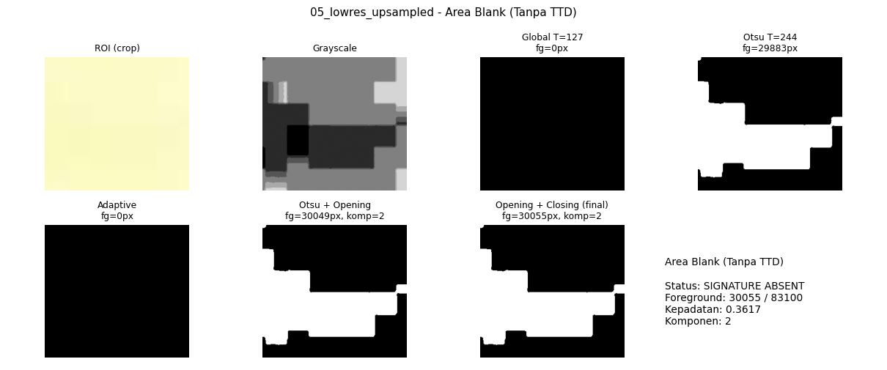

Hasil sesuai harapan: **Ya**

### 6. Citra 6 (faded_underexposed)

**Area Rektor (Ada TTD)**

| Karakteristik (Otsu + opening + closing) | Nilai |
|---|---|
| Status | **SIGNATURE PRESENT** |
| Foreground pixels | 1964 / 30000 |
| Kepadatan piksel | 0.0655 |
| Komponen terhubung | 1 |
| Connectivity | 1.00 |
| Kontras tinta | 0.312 |

**Analisis perbandingan**

- Thresholding
  - Global (T=127) menangkap 1180 piksel (64% dari Otsu): sebagian goresan hilang.
  - Otsu memilih T=139 secara otomatis dan menangkap 1849 piksel foreground (2 komponen).
  - Adaptive menangkap 1434 piksel dengan 3 komponen; jumlah komponennya mirip Otsu.
- Morfologi
  - Opening: komponen 2 -> 2, foreground 1849 -> 1859 piksel. Closing: komponen 2 -> 1, foreground 1859 -> 1964 piksel. Hasil akhir: komponen terbesar mencakup 100% dari seluruh foreground (connectivity).

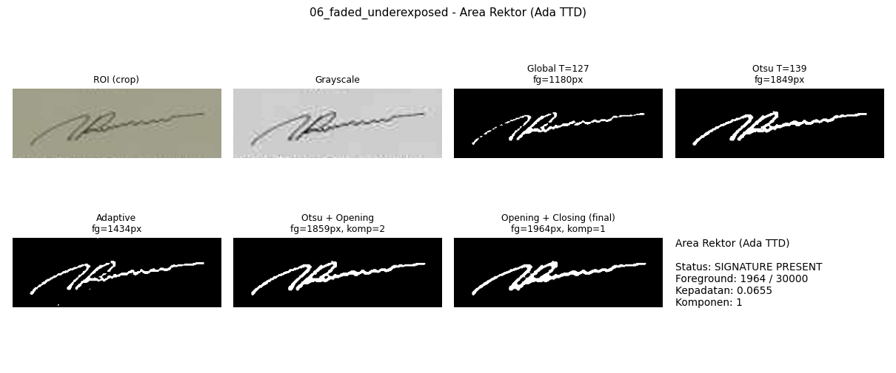

Hasil sesuai harapan: **Ya**

**Area Dekan (Ada TTD)**

| Karakteristik (Otsu + opening + closing) | Nilai |
|---|---|
| Status | **SIGNATURE PRESENT** |
| Foreground pixels | 5517 / 36000 |
| Kepadatan piksel | 0.1532 |
| Komponen terhubung | 5 |
| Connectivity | 0.94 |
| Kontras tinta | 0.392 |

**Analisis perbandingan**

- Thresholding
  - Global (T=127) menangkap 3107 piksel (62% dari Otsu): sebagian goresan hilang.
  - Otsu memilih T=138 secara otomatis dan menangkap 5011 piksel foreground (9 komponen).
  - Adaptive menangkap 3301 piksel dengan 29 komponen; terdapat bintik noise tambahan di sekitar goresan.
- Morfologi
  - Opening: komponen 9 -> 9, foreground 5011 -> 5009 piksel. Closing: komponen 9 -> 5, foreground 5009 -> 5517 piksel. Hasil akhir: komponen terbesar mencakup 94% dari seluruh foreground (connectivity).

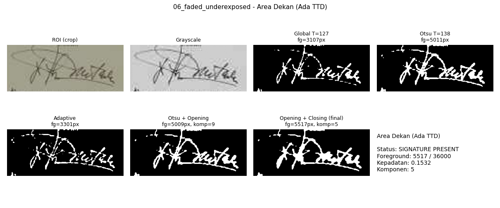

Hasil sesuai harapan: **Ya**

**Area Blank (Tanpa TTD)**

| Karakteristik (Otsu + opening + closing) | Nilai |
|---|---|
| Status | **SIGNATURE ABSENT** |
| Foreground pixels | 21171 / 84300 |
| Kepadatan piksel | 0.2511 |
| Komponen terhubung | 2 |
| Connectivity | 0.91 |
| Kontras tinta | 0.006 |

**Analisis perbandingan**

- Thresholding
  - Global (T=127): 0 piksel foreground; kertas kosong lebih terang dari 127 sehingga hampir bersih.
  - Otsu (T=156) menghasilkan 20957 piksel foreground (24.9% dari ROI). Ini bukan tinta: Otsu selalu membagi histogram menjadi dua kelas, sehingga pada ROI tanpa tinta ia memotong gradien/noise kertas.
  - Adaptive menghasilkan 0 piksel foreground (0 komponen).
- Morfologi
  - Morfologi: komponen 2 -> 2, foreground 20957 -> 21171 piksel. Keputusan ABSENT ditentukan oleh syarat kontras tinta: ink_contrast = 0.006 (< 0,10), artinya tidak ada piksel yang benar-benar gelap dibanding kertas.

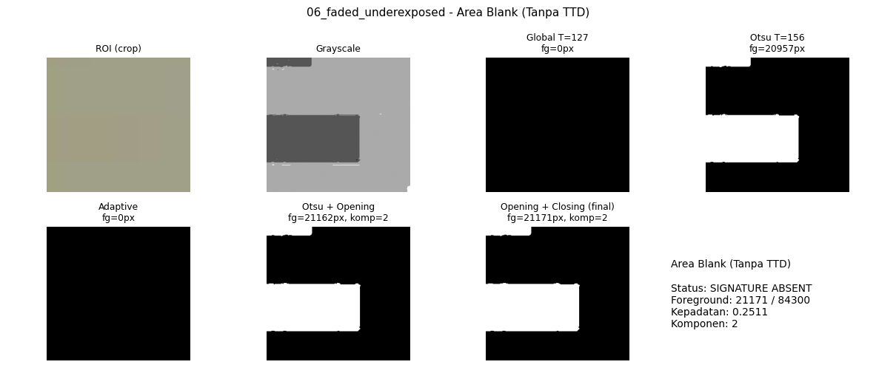

Hasil sesuai harapan: **Ya**

### 7. Citra 7 (colorshift_warmtint)

**Area Rektor (Ada TTD)**

| Karakteristik (Otsu + opening + closing) | Nilai |
|---|---|
| Status | **SIGNATURE PRESENT** |
| Foreground pixels | 1727 / 29400 |
| Kepadatan piksel | 0.0587 |
| Komponen terhubung | 1 |
| Connectivity | 1.00 |
| Kontras tinta | 0.469 |

**Analisis perbandingan**

- Thresholding
  - Global (T=127) hanya menangkap 299 piksel (18% dari hasil Otsu): goresan tipis terputus atau hilang karena intensitasnya di atas 127 (false negative).
  - Otsu memilih T=194 secara otomatis dan menangkap 1631 piksel foreground (2 komponen).
  - Adaptive menangkap 1645 piksel dengan 2 komponen; jumlah komponennya mirip Otsu.
- Morfologi
  - Opening: komponen 2 -> 2, foreground 1631 -> 1634 piksel. Closing: komponen 2 -> 1, foreground 1634 -> 1727 piksel. Hasil akhir: komponen terbesar mencakup 100% dari seluruh foreground (connectivity).

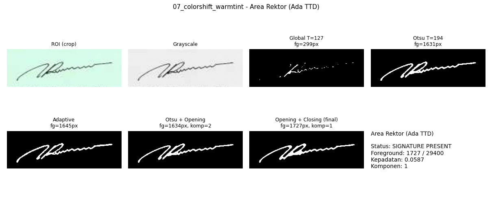

Hasil sesuai harapan: **Ya**

**Area Dekan (Ada TTD)**

| Karakteristik (Otsu + opening + closing) | Nilai |
|---|---|
| Status | **SIGNATURE PRESENT** |
| Foreground pixels | 5241 / 35700 |
| Kepadatan piksel | 0.1468 |
| Komponen terhubung | 6 |
| Connectivity | 0.93 |
| Kontras tinta | 0.586 |

**Analisis perbandingan**

- Thresholding
  - Global (T=127) hanya menangkap 921 piksel (20% dari hasil Otsu): goresan tipis terputus atau hilang karena intensitasnya di atas 127 (false negative).
  - Otsu memilih T=195 secara otomatis dan menangkap 4713 piksel foreground (9 komponen).
  - Adaptive menangkap 4689 piksel dengan 7 komponen; jumlah komponennya mirip Otsu.
- Morfologi
  - Opening: komponen 9 -> 10, foreground 4713 -> 4690 piksel. Closing: komponen 10 -> 6, foreground 4690 -> 5241 piksel. Hasil akhir: komponen terbesar mencakup 93% dari seluruh foreground (connectivity).

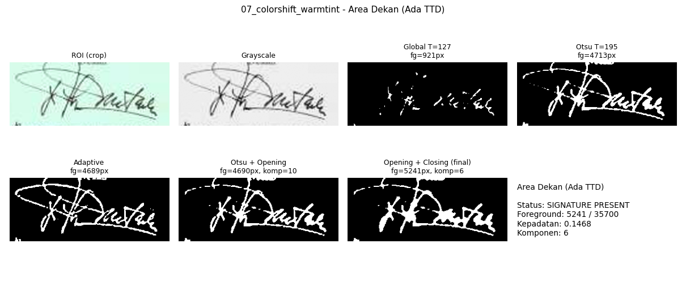

Hasil sesuai harapan: **Ya**

**Area Blank (Tanpa TTD)**

| Karakteristik (Otsu + opening + closing) | Nilai |
|---|---|
| Status | **SIGNATURE ABSENT** |
| Foreground pixels | 36174 / 82800 |
| Kepadatan piksel | 0.4369 |
| Komponen terhubung | 1 |
| Connectivity | 1.00 |
| Kontras tinta | 0.021 |

**Analisis perbandingan**

- Thresholding
  - Global (T=127): 0 piksel foreground; kertas kosong lebih terang dari 127 sehingga hampir bersih.
  - Otsu (T=235) menghasilkan 35667 piksel foreground (43.1% dari ROI). Ini bukan tinta: Otsu selalu membagi histogram menjadi dua kelas, sehingga pada ROI tanpa tinta ia memotong gradien/noise kertas.
  - Adaptive menghasilkan 0 piksel foreground (0 komponen).
- Morfologi
  - Morfologi: komponen 1 -> 1, foreground 35667 -> 36174 piksel. Keputusan ABSENT ditentukan oleh syarat kontras tinta: ink_contrast = 0.021 (< 0,10), artinya tidak ada piksel yang benar-benar gelap dibanding kertas.

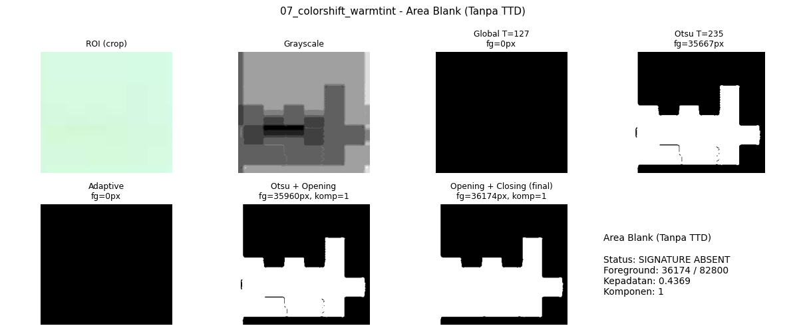

Hasil sesuai harapan: **Ya**

### 8. Citra 8 (jpeg_artifacts)

**Area Rektor (Ada TTD)**

| Karakteristik (Otsu + opening + closing) | Nilai |
|---|---|
| Status | **SIGNATURE PRESENT** |
| Foreground pixels | 1679 / 29700 |
| Kepadatan piksel | 0.0565 |
| Komponen terhubung | 1 |
| Connectivity | 1.00 |
| Kontras tinta | 0.474 |

**Analisis perbandingan**

- Thresholding
  - Global (T=127) hanya menangkap 283 piksel (18% dari hasil Otsu): goresan tipis terputus atau hilang karena intensitasnya di atas 127 (false negative).
  - Otsu memilih T=199 secara otomatis dan menangkap 1587 piksel foreground (2 komponen).
  - Adaptive menangkap 1658 piksel dengan 2 komponen; jumlah komponennya mirip Otsu.
- Morfologi
  - Opening: komponen 2 -> 2, foreground 1587 -> 1596 piksel. Closing: komponen 2 -> 1, foreground 1596 -> 1679 piksel. Hasil akhir: komponen terbesar mencakup 100% dari seluruh foreground (connectivity).


Hasil sesuai harapan: **Ya**

**Area Dekan (Ada TTD)**

| Karakteristik (Otsu + opening + closing) | Nilai |
|---|---|
| Status | **SIGNATURE PRESENT** |
| Foreground pixels | 5213 / 36000 |
| Kepadatan piksel | 0.1448 |
| Komponen terhubung | 5 |
| Connectivity | 0.93 |
| Kontras tinta | 0.591 |

**Analisis perbandingan**

- Thresholding
  - Global (T=127) hanya menangkap 855 piksel (18% dari hasil Otsu): goresan tipis terputus atau hilang karena intensitasnya di atas 127 (false negative).
  - Otsu memilih T=200 secara otomatis dan menangkap 4682 piksel foreground (8 komponen).
  - Adaptive menangkap 4747 piksel dengan 8 komponen; jumlah komponennya mirip Otsu.
- Morfologi
  - Opening: komponen 8 -> 12, foreground 4682 -> 4648 piksel. Closing: komponen 12 -> 5, foreground 4648 -> 5213 piksel. Hasil akhir: komponen terbesar mencakup 93% dari seluruh foreground (connectivity).

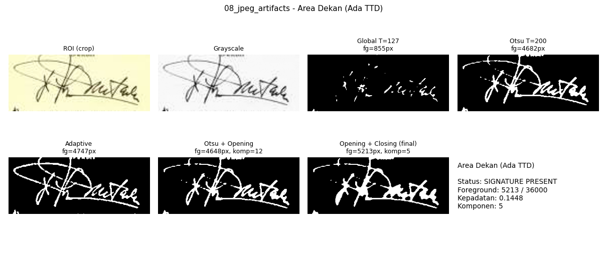

Hasil sesuai harapan: **Ya**

**Area Blank (Tanpa TTD)**

| Karakteristik (Otsu + opening + closing) | Nilai |
|---|---|
| Status | **SIGNATURE ABSENT** |
| Foreground pixels | 31344 / 83400 |
| Kepadatan piksel | 0.3758 |
| Komponen terhubung | 7 |
| Connectivity | 0.90 |
| Kontras tinta | 0.020 |

**Analisis perbandingan**

- Thresholding
  - Global (T=127): 0 piksel foreground; kertas kosong lebih terang dari 127 sehingga hampir bersih.
  - Otsu (T=243) menghasilkan 31154 piksel foreground (37.4% dari ROI). Ini bukan tinta: Otsu selalu membagi histogram menjadi dua kelas, sehingga pada ROI tanpa tinta ia memotong gradien/noise kertas.
  - Adaptive menghasilkan 0 piksel foreground (0 komponen).
- Morfologi
  - Morfologi: komponen 7 -> 7, foreground 31154 -> 31344 piksel. Keputusan ABSENT ditentukan oleh syarat kontras tinta: ink_contrast = 0.020 (< 0,10), artinya tidak ada piksel yang benar-benar gelap dibanding kertas.

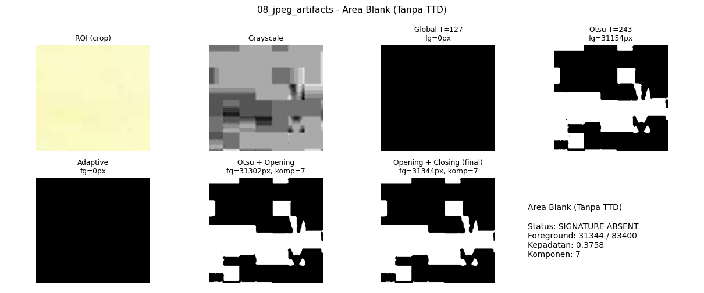

Hasil sesuai harapan: **Ya**

### 9. Citra 9 (combined_degradation)

**Area Rektor (Ada TTD)**

| Karakteristik (Otsu + opening + closing) | Nilai |
|---|---|
| Status | **SIGNATURE PRESENT** |
| Foreground pixels | 1940 / 30000 |
| Kepadatan piksel | 0.0647 |
| Komponen terhubung | 1 |
| Connectivity | 1.00 |
| Kontras tinta | 0.395 |

**Analisis perbandingan**

- Thresholding
  - Global (T=127) hanya menangkap 549 piksel (31% dari hasil Otsu): goresan tipis terputus atau hilang karena intensitasnya di atas 127 (false negative).
  - Otsu memilih T=161 secara otomatis dan menangkap 1799 piksel foreground (2 komponen).
  - Adaptive menangkap 1638 piksel dengan 2 komponen; jumlah komponennya mirip Otsu.
- Morfologi
  - Opening: komponen 2 -> 2, foreground 1799 -> 1810 piksel. Closing: komponen 2 -> 1, foreground 1810 -> 1940 piksel. Hasil akhir: komponen terbesar mencakup 100% dari seluruh foreground (connectivity).

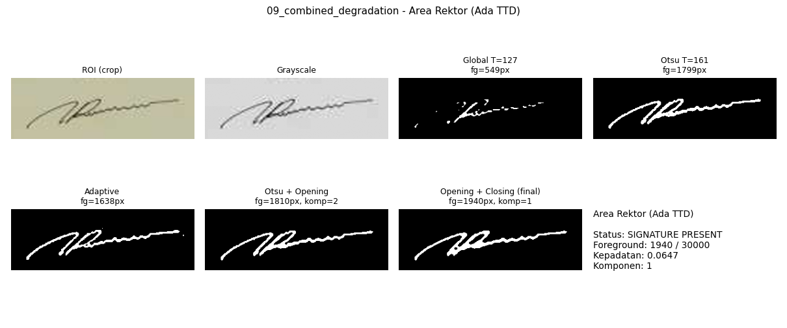

Hasil sesuai harapan: **Ya**

**Area Dekan (Ada TTD)**

| Karakteristik (Otsu + opening + closing) | Nilai |
|---|---|
| Status | **SIGNATURE PRESENT** |
| Foreground pixels | 5344 / 36000 |
| Kepadatan piksel | 0.1484 |
| Komponen terhubung | 6 |
| Connectivity | 0.95 |
| Kontras tinta | 0.500 |

**Analisis perbandingan**

- Thresholding
  - Global (T=127) hanya menangkap 1544 piksel (32% dari hasil Otsu): goresan tipis terputus atau hilang karena intensitasnya di atas 127 (false negative).
  - Otsu memilih T=160 secara otomatis dan menangkap 4842 piksel foreground (7 komponen).
  - Adaptive menangkap 4212 piksel dengan 21 komponen; terdapat bintik noise tambahan di sekitar goresan.
- Morfologi
  - Opening: komponen 7 -> 7, foreground 4842 -> 4853 piksel. Closing: komponen 7 -> 6, foreground 4853 -> 5344 piksel. Hasil akhir: komponen terbesar mencakup 95% dari seluruh foreground (connectivity).

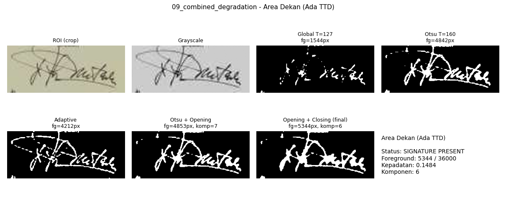

Hasil sesuai harapan: **Ya**

**Area Blank (Tanpa TTD)**

| Karakteristik (Otsu + opening + closing) | Nilai |
|---|---|
| Status | **SIGNATURE ABSENT** |
| Foreground pixels | 80407 / 84000 |
| Kepadatan piksel | 0.9572 |
| Komponen terhubung | 1 |
| Connectivity | 1.00 |
| Kontras tinta | 0.005 |

**Analisis perbandingan**

- Thresholding
  - Global (T=127): 0 piksel foreground; kertas kosong lebih terang dari 127 sehingga hampir bersih.
  - Otsu (T=188) menghasilkan 80301 piksel foreground (95.6% dari ROI). Ini bukan tinta: Otsu selalu membagi histogram menjadi dua kelas, sehingga pada ROI tanpa tinta ia memotong gradien/noise kertas.
  - Adaptive menghasilkan 0 piksel foreground (0 komponen).
- Morfologi
  - Morfologi: komponen 1 -> 1, foreground 80301 -> 80407 piksel. Keputusan ABSENT ditentukan oleh syarat kontras tinta: ink_contrast = 0.005 (< 0,10), artinya tidak ada piksel yang benar-benar gelap dibanding kertas.

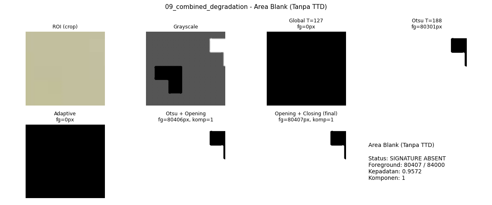

Hasil sesuai harapan: **Ya**

<!-- HASIL-PER-CITRA:END -->
